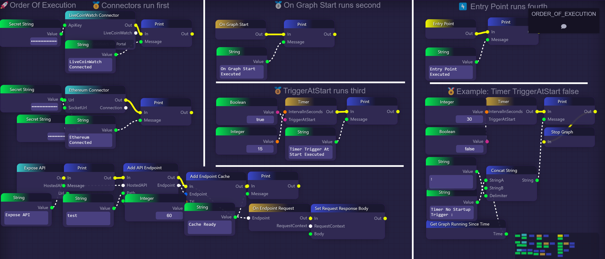
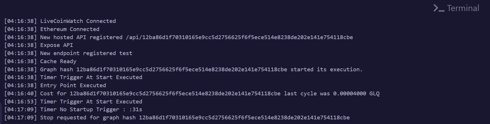

# Additional Block Execution

Here is an example Graph that shows the order of execution.

<figure><figcaption>
Sample Graph (Click to enlarge)
</figcaption></figure>

<figure><figcaption>
Connectors run first
</figcaption></figure>

<figure><figcaption>
On Graph Start run second
</figcaption></figure>

<figure><figcaption>
TriggerAtStart option on a Timer will run third
</figcaption></figure>

<figure><figcaption>
Finally, the Entry Point is executed
</figcaption></figure>

<figure><figcaption>
Example showing when a timer will trigger with 'TriggerAtStart' set to false
</figcaption></figure>

Finally, let's inspect the output from the Graph

<figure><figcaption>
Terminal output of the running Graph.
</figcaption></figure>

