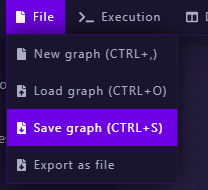

# Importing Graph/Template

With the IDE, you can first create your graph and export it as .GLQ file, then, you can either select a template from the lists and deploy in on the dashboard interface or the .GLQ file that you generated with the graph IDE over `Save graph` in the `File` Menu.

Once you are on the dashboard interface you just need to import your file and execute it over `Deploy a New Graph`: One unique hash and an alias name will be set to recognize your graph. You will then be in control of the graph state / cycle costs and be able to view logs of executions, also later on we will add stats with specific information of the execution.

.png>)

