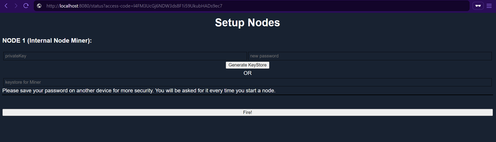
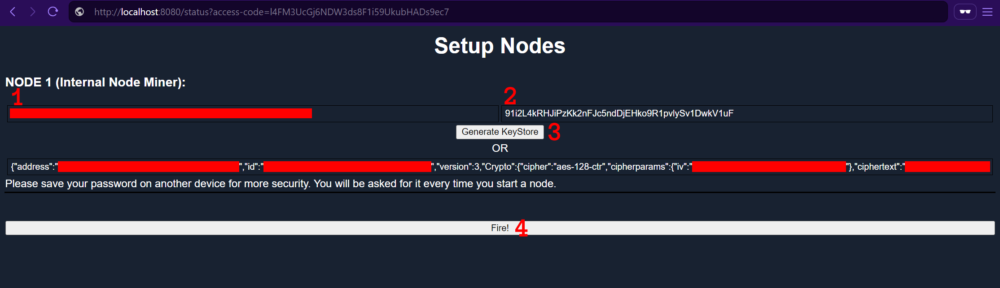
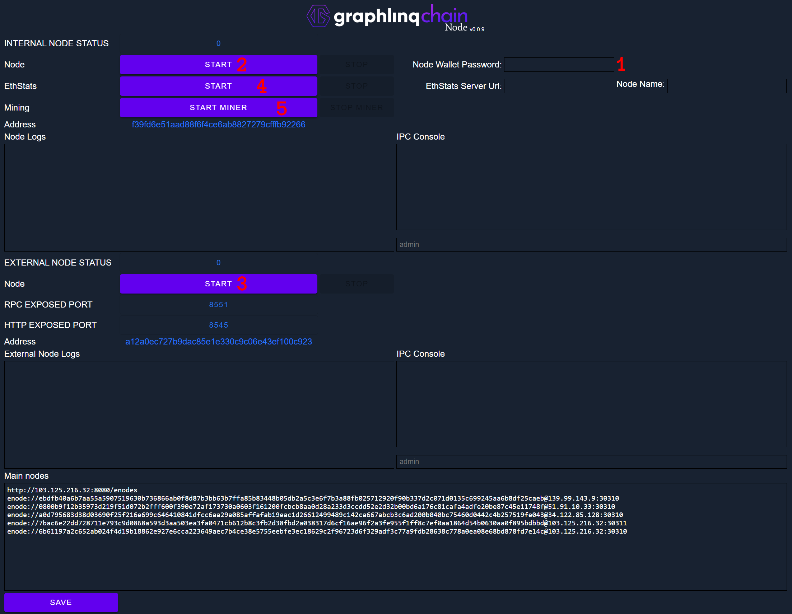

# Installation

### 1.  Pull The Docker Image

Download the image from the Docker Hub registry.

```bash
docker pull graphlinqchain/docker-glq-nodemanager:v0.0.9
```


[Docker Pull Documentation](https://docs.docker.com/reference/cli/docker/image/pull/)


### 2.  Create And Run A New Container From An Image

```bash
docker run -d --restart unless-stopped -p 8080:8080 -p 8545:8545 \
-p 8551:8551 -p 30310:30310 -p 30311:30311 \
graphlinqchain/docker-glq-nodemanager:v0.0.9
```


You may want to use a different Restart Policy or only expose the ports that you need. [Docker Run Documentation](https://docs.docker.com/reference/cli/docker/container/run/)



If you are running a firewall or are behind a router that uses NAT, you will need to open the ports you want accessible.&#x20;


### 3.  Setup First Access Password&#x20;

To begin setting up your GraphLinq node, navigate to http(s)://ip:8080/status. Here, you'll be prompted to set an access password to secure the node management. It's important to choose a strong password of at least 15 characters to ensure maximum security. Once you've entered your chosen password, you'll be taken to the setup page to continue the process.

<figure><figcaption></figcaption></figure>


Example: http://localhost:8080/status?access-code=NodeManagerPasswordExample



Please use a secure password. We suggest 15 characters minimum. \[a-z]\[A-Z]\[0-9]


### 4.  Node Setup&#x20;

In the Node Setup section, you will need to provide a KeyStore or the secret of a wallet, and define a strong password to create a KeyStore. This step is crucial to protect your node from any potential risks. You can refer to the image provided for guidance.

<figure><figcaption></figcaption></figure>


We suggest using a different password than the access-code to the admin interface.



Please use a secure password. We suggest 15 characters minimum. \[a-z]\[A-Z]\[0-9]


After providing the necessary information, simply click on the "Fire!" button to launch your node.

<figure><figcaption></figcaption></figure>

1. The private key for the wallet you want to use.
2. The password for unlocking the wallet.
3. Click "Generate KeyStore".
4. Click "Fire!" to complete the setup.

### 5.  Node Management Page

After pressing "Fire!" you will automatically be taken to the Node Management Page. To access this page in the future, you must include the "access-code" in your request that you chose in [Step 3](installation.md#id-3.-setup-first-access-password).

<figure><figcaption><p>Numbers in the image correspond to the steps below.</p></figcaption></figure>

1. Enter your KeyStore password in the "Node Wallet Password" field. This is the password you chose in [Step 4](installation.md#id-4.-node-setup).&#x20;
2. Press "START to begin synchronizing the Internal Node with the blockchain.
3. If you want to expose the HTTP and RPC ports click on this "START" button once the previous step has finished synchronizing .
4. To publish your Node to the [GraphLinq Chain Network Status](https://network.graphlinq.io/) page you will need to enter the "EthStats Server Url" and give your Node a "Node Name". Then click "START". This link is only provided to Validators.
5. If you have been designated as a Validator, you can click on the "START MINER" button.

That's it! Your node is now running.


It is best to allow the Internal Node to finish syncing before starting the External Node.&#x20;



Before moving on to steps 4 and 5 it is best to have your Internal and External Node completely synced.



See [Becoming A Validator](installation.md#becoming-a-validator) for more information.


***

### 6.  Add Peers (Optional)

This step is not required however if you wish to add another Peer to your Node you can.

Example enode://

```
enode://3414c01c19aa75a34f2dbd2f8d0898dc79d6b219ad77f8155abf1a287ce2ba60f14998a3a98c0cf14915eabfdacf914a92b27a01769de18fa2d049dbf4c17694@10.10.23.196:30301
```

In the IPC Console use this command to add the peer.

```
admin.addPeer("enode://3414c01c19aa75a34f2dbd2f8d0898dc79d6b219ad77f8155abf1a287ce2ba60f14998a3a98c0cf14915eabfdacf914a92b27a01769de18fa2d049dbf4c17694@10.10.23.196:30301");
```


The current list of nodes is automatically downloaded from http://103.125.216.32:8080/enodes by default.


***

### Notes

* The main node is never accessible from the outside to increase security.
* You should only enter your password when launching the node
* The second node should only be started if you want to expose an RPC.
* The external node will be connected to the internal node.

### Becoming A Validator

The "START MINER" button is only available for validators who have been accepted by GraphLinq. If you are interested in becoming a validator, please contact the GraphLinq team at [info@graphlinq.io](mailto:info@graphlinq.io).
